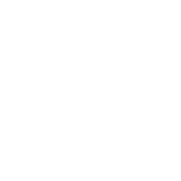

<h1 align="center">
	
</h1>

---

# :pushpin: Índice

- ℹ [Sobre o Projeto](#sobreoprojeto)
- 🚀 [Implementações Futuras](#implementacoesfuturas)
- 💻 [Tecnologias](#Tecnologias)
- 👤 [Autores](#Autores)
- 🤝 [Orientadores](#Orientadores)
- 📜 [Licença](#Licença)

---

# ℹ  Sobre o Projeto

 
Com base na ODS 9 da ONU, que tem como um dos objetivos construir infraestruturas resilientes, promover a industrialização inclusiva e sustentável e fomentar a inovação. Até 2030, modernizar a infraestrutura e reabilitar as indústrias para torná-las sustentáveis, com eficiência aumentada no uso de recursos e maior adoção de tecnologias e processos industriais limpos e ambientalmente corretos; com todos os países atuando de acordo com suas respectivas capacidades.

 
As emissões industriais são um grande desafio ambiental, liberando gases de efeito estufa e poluentes como VOCs e SO2, causando doenças e mudanças climáticas. A contaminação de água e solo afeta ecossistemas e saúde pública. Práticas sustentáveis e tecnologias limpas são essenciais para mitigar esses impactos.

 
O projeto visa estabelecer uma plataforma de colaboração entre pequenas e médias empresas (PMEs) que oferecem soluções ambientalmente amigáveis e grandes corporações com influência global. A iniciativa busca alinhar as operações dessas empresas às metas de sustentabilidade da ONU, promovendo a inovação, o crescimento econômico inclusivo e a mitigação dos impactos ambientais.

***Contaremos duas visões:***

**- Experiência do Usuário**

No início da página, Após o usúario preencher o formulário de cadastro, encontrará o menu superior, onde poderá navegar para uma página “Serviços”, "Setor de Atuação", "Cadastrar Setor" com um formulário para se cadastrar para se tornar um prestador de serviços para outras empresas e "Perfil" para que o usuário possa gerenciar as suas informações.

*- Sobre Nós:* 
O usúario terá a oportunidade de conhecer o objetivo do projeto e um pouco de cada integrante da equipe.

*- Os usuários podem se cadastrar na nossa plataforma web, onde iremos coletar as seguintes informações:* 
RazãoSocial 
CNPJ 
E-mail 
Senha 
Foto 

-> Cada informação será codificada e salva no banco de dados na hora de sua criação do cadastro.

*- Login:* 
O usúario efetuará o Login por meio do usuário e senha, que serão definidos no ato do cadastro.

**- Experiência dos Administradores**

O administrador poderá acessar o BackEnd, onde ele pode editar os usúarios, cadastrar novos produtos e possiveis categorias.

---
# 🚀 Implementações Futuras

- Implementar avaliação de Serviços oferecidos na plataforma 
- Rankiar serviços com base em votação de usuários
- Implementar histórico de Serviços para o usuário contratante 

---
# 💻 Tecnologias

IDE: Visual Studio Code

- Linguagens de programação:

  
  
  

 

- Linguagem de marcação:

 

 

- Linguagem Cascading Style Sheet:

  

 

- Frameworks:

  
  

- Testes:

  

 

- Database:

  

 

- Deploy: Netlify [Link do site final](https://renovatech.netlify.app/)

-- BSM: Orientação ao futuro, responsabilidade pessoal, mentalidade de crescimento, persistência, trabalho em equipe, atenção ao detalhe, proatividade e comunicação.

---

# 👤 Autores

<table>
	<tr>
		<td align="center">
			<a href="https://github.com/Ana-Paola24">
				
				 
				
					<b>Ana Paola </b>
				
			</a>
		</td>
		<td align="center">
			<a href="https://github.com/Ellenmape">
				
				 
				
					<b>Ellen Silva </b>
				
			</a>
		</td>
		<td align="center">
			<a href="https://github.com/indialkm">
				
				 
				
					<b>Ingrid Alkimim </b>
				
			</a>
		</td>
		<td align="center">
			<a href="https://github.com/MatheusAlcn">
				
				 
				
					<b>Matheus Alcântara</b>
				
			</a>
		</td>
		<td align="center">
			<a href="https://github.com/renansramos">
				
				 
				
					<b>Renan Ramos </b>
				
			</a>
		</td>
        <td align="center">
			<a href="https://github.com/V1ctorSantos">
				
				 
				
					<b>Victor Santos </b>
				
			</a>
		</td>
	</tr>
</table>

---

# 🤝 Orientadores

Instrutores que nos acompanharam do começo ao fim do projeto.

<table>
  <tr>
          <td align="center">
			<a href="https://github.com/jacquelinesantana">
				
				 
				
					<b>Jacqueline Hernandes</b>
				
			</a>
		</td>
    <td align="center">
			<a href="https://github.com/tjfaccipieri">
				
				 
				
					<b>Thiago Faccipieri</b>
				
			</a>
		</td></td>	  
</tr>
</table>

---

# 📜 Licença

Copyright :copyright: 2024 [Renovatech - Melissa Duarte, Gbariel Ângelo, João Lirio , Matheus Alcântara, Leonardo de Oliveira, Maria Eduarda, Natasha Lorenzano](https://github.com/RenovaTech-06/react-renovatech).
 
 

---